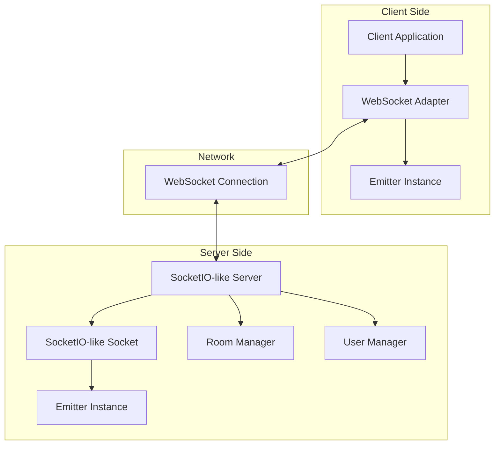

# Design Document

## Overview

La librería ws-socketio-adapter proporciona una implementación completa que emula la API de Socket.IO usando WebSockets nativos. La arquitectura actual incluye tres componentes principales: un sistema de eventos personalizado (Emitter), un adaptador de cliente WebSocket, y un servidor multi-conexión. El diseño se enfoca en completar la funcionalidad faltante, optimizar el rendimiento, y proporcionar herramientas de desarrollo profesionales.

## Architecture

### High-Level Architecture



### Core Components

1. **Emitter System**: Sistema de eventos personalizado que maneja listeners, callbacks y eventos especiales
2. **Client Adapter**: Adaptador que convierte WebSocket nativo a API compatible con Socket.IO
3. **Server Manager**: Servidor que maneja múltiples conexiones WebSocket con funcionalidad de rooms
4. **Type System**: Sistema de tipos TypeScript completo para compatibilidad y desarrollo

## Components and Interfaces

### 1. Enhanced Emitter System

**Current Implementation**: `src/Emitter.ts`
- ✅ Eventos básicos (on, once, emit, off)
- ✅ Listeners "any" (onAny, onceAny)
- ✅ Gestión de memoria y límites
- ✅ Métodos de debugging y cleanup

**Enhancements Needed**:
- Namespace support para eventos
- Performance optimizations para high-frequency events
- Event validation y error handling mejorado

### 2. Client WebSocket Adapter

**Current Implementation**: `src/client/ws-adapter.ts`
- ✅ Conexión WebSocket básica
- ✅ Eventos connect/disconnect
- ✅ Callback handling con acknowledgments
- ✅ Reconexión automática básica

**Enhancements Needed**:
```typescript
interface EnhancedClientOptions {
  query?: Record<string, string>;
  transports?: string[];
  autoConnect?: boolean;
  reconnection?: boolean;
  reconnectionAttempts?: number;
  reconnectionDelay?: number;
  timeout?: number;
  forceNew?: boolean;
  multiplex?: boolean;
  auth?: Record<string, any>;
}

interface SocketIOClientAPI {
  // Propiedades de estado
  id: string;
  connected: boolean;
  disconnected: boolean;
  
  // Métodos de eventos
  on(event: string, callback: Function): Socket;
  once(event: string, callback: Function): Socket;
  off(event: string, callback?: Function): Socket;
  onAny(callback: Function): Socket;
  offAny(callback?: Function): Socket;
  
  // Métodos de comunicación
  emit(event: string, ...args: any[]): Socket;
  send(...args: any[]): Socket;
  
  // Métodos de conexión
  connect(): Socket;
  disconnect(): Socket;
  
  // Métodos avanzados
  compress(compress: boolean): Socket;
  timeout(timeout: number): Socket;
}
```

### 3. Server WebSocket Manager

**Current Implementation**: `src/server/SocketIOLikeAdapter.ts`
- ✅ Múltiples conexiones WebSocket
- ✅ Sistema de rooms básico
- ✅ Broadcasting a usuarios y salas
- ✅ Gestión de usuarios conectados

**Enhancements Needed**:
```typescript
interface ServerEnhancements {
  // Namespace support
  of(namespace: string): Namespace;
  
  // Middleware support
  use(middleware: (socket: Socket, next: Function) => void): Server;
  
  // Advanced room operations
  in(room: string): BroadcastOperator;
  to(room: string): BroadcastOperator;
  except(room: string): BroadcastOperator;
  
  // Server management
  close(callback?: Function): void;
  engine: {
    generateId: () => string;
    clientsCount: number;
  };
}

interface NamespaceAPI {
  name: string;
  sockets: Map<string, Socket>;
  use(middleware: Function): Namespace;
  emit(event: string, ...args: any[]): boolean;
  to(room: string): BroadcastOperator;
  in(room: string): BroadcastOperator;
}
```

### 4. Enhanced Type System

**Current Implementation**: `src/types.ts`
- ✅ Interfaces básicas (ISocket, CustomSocket)
- ✅ Tipos para User y Room
- ✅ Integración con ParsedUrlQuery

**Enhancements Needed**:
```typescript
// Generic event typing
interface TypedEventEmitter<T extends Record<string, any>> {
  on<K extends keyof T>(event: K, listener: (...args: T[K]) => void): this;
  emit<K extends keyof T>(event: K, ...args: T[K]): boolean;
}

// Socket.IO compatible types
interface ServerToClientEvents {
  [event: string]: (...args: any[]) => void;
}

interface ClientToServerEvents {
  [event: string]: (...args: any[]) => void;
}

interface InterServerEvents {
  [event: string]: (...args: any[]) => void;
}

interface SocketData {
  [key: string]: any;
}
```

## Data Models

### Connection State Management

```typescript
interface ConnectionState {
  id: string;
  status: 'connecting' | 'connected' | 'disconnecting' | 'disconnected';
  transport: 'websocket';
  lastActivity: number;
  connectionTime: number;
  reconnectAttempts: number;
  rooms: Set<string>;
  auth?: Record<string, any>;
}

interface ServerState {
  connections: Map<string, ConnectionState>;
  rooms: Map<string, Set<string>>;
  namespaces: Map<string, NamespaceState>;
  middleware: Function[];
  options: ServerOptions;
}
```

### Message Protocol

```typescript
interface WSMessage {
  event: string;
  payload: any[];
  callbackId?: string;
  namespace?: string;
  room?: string;
}

interface CallbackResponse {
  event: 'callback-response';
  callbackId: string;
  payload: any[];
  error?: string;
}
```

## Error Handling

### Client-Side Error Handling

```typescript
interface ClientErrorHandling {
  // Connection errors
  'connect_error': (error: Error) => void;
  'disconnect': (reason: string, details?: any) => void;
  'error': (error: Error) => void;
  
  // Reconnection events
  'reconnect': (attemptNumber: number) => void;
  'reconnect_attempt': (attemptNumber: number) => void;
  'reconnect_error': (error: Error) => void;
  'reconnect_failed': () => void;
}
```

### Server-Side Error Handling

```typescript
interface ServerErrorHandling {
  // Connection lifecycle
  'connection_error': (error: Error, socket: Socket) => void;
  'disconnect': (socket: Socket, reason: string) => void;
  
  // Message handling
  'message_error': (error: Error, socket: Socket, message: any) => void;
  'parse_error': (error: Error, socket: Socket, rawMessage: string) => void;
  
  // Server errors
  'server_error': (error: Error) => void;
}
```

## Testing Strategy

### Unit Testing Structure

```
tests/
├── unit/
│   ├── emitter.test.ts          # Test Emitter functionality
│   ├── client-adapter.test.ts   # Test client WebSocket adapter
│   ├── server-adapter.test.ts   # Test server functionality
│   └── types.test.ts            # Test TypeScript types
├── integration/
│   ├── client-server.test.ts    # Test full communication
│   ├── rooms.test.ts            # Test room functionality
│   ├── namespaces.test.ts       # Test namespace support
│   └── reconnection.test.ts     # Test reconnection logic
├── performance/
│   ├── load.test.ts             # Load testing
│   ├── memory.test.ts           # Memory usage testing
│   └── concurrent.test.ts       # Concurrent connections
└── compatibility/
    ├── socketio-compat.test.ts  # Socket.IO compatibility
    └── migration.test.ts        # Migration scenarios
```

### Testing Framework Configuration

```typescript
// Jest configuration for comprehensive testing
interface TestConfig {
  testEnvironment: 'node';
  setupFilesAfterEnv: ['<rootDir>/tests/setup.ts'];
  testMatch: ['**/*.test.ts'];
  collectCoverageFrom: [
    'src/**/*.ts',
    '!src/**/*.d.ts',
    '!src/types.ts'
  ];
  coverageThreshold: {
    global: {
      branches: 80,
      functions: 80,
      lines: 80,
      statements: 80
    }
  };
}
```

## Project Configuration

### TypeScript Configuration

```json
{
  "compilerOptions": {
    "target": "ES2020",
    "module": "commonjs",
    "lib": ["ES2020"],
    "declaration": true,
    "declarationMap": true,
    "outDir": "./dist",
    "rootDir": "./src",
    "strict": true,
    "esModuleInterop": true,
    "skipLibCheck": true,
    "forceConsistentCasingInFileNames": true,
    "moduleResolution": "node",
    "resolveJsonModule": true,
    "allowSyntheticDefaultImports": true
  },
  "include": ["src/**/*"],
  "exclude": ["node_modules", "dist", "tests"]
}
```

### Package.json Enhancements

```json
{
  "name": "ws-socketio-adapter",
  "version": "1.0.0",
  "description": "Socket.IO compatible WebSocket adapter",
  "main": "dist/index.js",
  "types": "dist/index.d.ts",
  "scripts": {
    "build": "tsc",
    "dev": "tsc --watch",
    "test": "jest",
    "test:watch": "jest --watch",
    "test:coverage": "jest --coverage",
    "lint": "eslint src/**/*.ts",
    "format": "prettier --write src/**/*.ts"
  },
  "keywords": ["websocket", "socket.io", "adapter", "typescript"],
  "files": ["dist/**/*", "README.md", "LICENSE"]
}
```

## Documentation Structure

### Documentation Organization

```
docs/
├── README.md                    # Main documentation
├── api/
│   ├── client.md               # Client API reference
│   ├── server.md               # Server API reference
│   └── types.md                # TypeScript types
├── guides/
│   ├── installation.md         # Installation guide
│   ├── migration.md            # Migration from Socket.IO
│   ├── examples.md             # Code examples
│   └── best-practices.md       # Best practices
├── examples/
│   ├── basic-chat/             # Basic chat example
│   ├── rooms-demo/             # Rooms functionality
│   ├── authentication/         # Auth integration
│   └── performance/            # Performance examples
└── contributing/
    ├── development.md          # Development setup
    ├── testing.md              # Testing guidelines
    └── release.md              # Release process
```

## Performance Considerations

### Memory Optimization

- **Connection pooling**: Reutilizar objetos de conexión
- **Event listener cleanup**: Automatic cleanup de listeners inactivos
- **Message batching**: Agrupar mensajes para reducir overhead
- **Garbage collection**: Minimizar allocations en hot paths

### Network Optimization

- **Message compression**: Soporte para compresión de mensajes
- **Binary data**: Soporte eficiente para datos binarios
- **Heartbeat optimization**: Ping/pong inteligente
- **Connection multiplexing**: Múltiples namespaces en una conexión

### Scalability Features

- **Horizontal scaling**: Preparación para múltiples instancias
- **Load balancing**: Soporte para balanceadores de carga
- **Metrics collection**: Recolección de métricas de rendimiento
- **Resource monitoring**: Monitoreo de uso de recursos